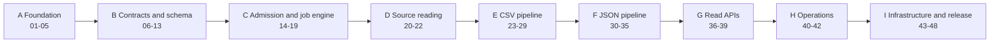
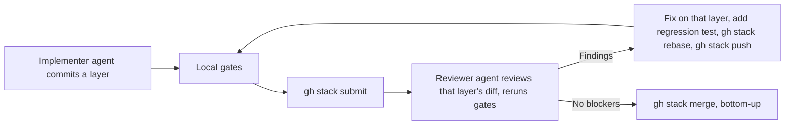

# Data Processing Service — Stacked PR Implementation Plan

Date: 2026-10-02
Repository: https://github.com/maverickuser/data-processing-service
Source of truth: [Structured File Processing LLD](../specs/structured-file-processing-lld.md)
Implementation inputs: [Implementation Context Specification](implementation-context-spec.md)
Standards: [Java standards](../engineering/java-standards.md), [testing strategy](../engineering/testing-strategy.md), [PR review policy](../engineering/pr-review.md)
Progress: [implementation status](implementation-status.md)

## Objective and boundaries

Implement the agreed LLD as about 48 small pull requests (the tables below are current; PR 12 was split in two and PR 13 folded into later PRs), grouped into nine stacks managed with GitHub Stacked PRs (`gh stack`). Every PR adds working, tested behaviour or concrete infrastructure. CI and CD run on GitHub Actions. This plan creates no branches, PRs, or AWS resources by itself.

Decisions preserved throughout:

- Java and Spring Boot on AWS Lambda behind API Gateway (LLD section 23). One build artifact deployed as five functions: API, worker, outbox sweeper, retention, migration. No containers, no load balancers, no Spring Batch.
- PostgreSQL on RDS with schemas `securities_data` and `data_processing`, managed by Flyway. Explicit SQL through `JdbcClient`; no JPA.
- Two-stage processing driven by the four YAML contracts in `contracts/`. Stage 1 produces canonical records; stage 2 maps them to the internal model.
- Full canonical output per run as JSON Lines in the service's own S3 bucket; only rejected records in PostgreSQL.
- Durable admission before `202`; transactional outbox for the internal FIFO processing queue and the external security-details queue.
- Exact arithmetic; no floating point.
- Public unauthenticated read APIs. Submission requires AWS IAM authorization (SigV4) at API Gateway, granted only to the fetch service's delivery role.
- Jobs run in parallel across ordering groups and in order within a group; worker concurrency is capped at 10 and each execution environment holds one database connection.
- One environment, `prod`, in `ap-south-1`. Terraform in three roots here: bootstrap, persistent, application. The shared network (VPC, subnets, NAT gateway, endpoints, Lambda security groups) is owned by the separate repository [cloud-platform-network](https://github.com/maverickuser/cloud-platform-network); this repository never defines network resources, it calls that repository's reusable workflow and reads its state.

## Pull request size

A PR is one idea a reviewer can hold in their head.

- Target at most about 400 changed lines of production code, tests excluded. If a PR grows past that, split it and record the split in the status file.
- One PR introduces one class cluster or one use case with its tests. It never mixes a refactor with a behaviour change.
- Every PR leaves `main`-plus-stack buildable and all gates green. No PR depends on a later PR to compile or pass.
- Code that is not yet reachable from a running path is acceptable only when it is fully unit-tested in that PR and wired by a later PR in the same stack.

## Stacks with GitHub Stacked PRs

The work is nine stacks rather than one chain of 48. A stack is short enough to review and merge within a few days, and the next stack starts from an up-to-date `main`.



Stack I's Terraform PRs (44–46) do not depend on application code and may be started in parallel with stacks E–H as a separate stack rooted at `main`.

### Working a stack

Install once: `gh extension install github/gh-stack`. Agents may also install its skill with `gh skill install github/gh-stack`.

```sh
# Start stack B from an up-to-date main; the first branch is the bottom of the stack
git switch main && git pull
gh stack init b/06-text-rules

# ...commit PR 06...

gh stack add b/07-numeric-rules      # next layer, on top of the current branch
# ...commit PR 07...  repeat for each PR in the stack

gh stack view                        # check order and state
gh stack submit                      # push every branch, open one PR per branch, link them as a Stack
```

- Branch names are `<stack letter>/<two-digit PR number>-<slug>`, matching the tables below.
- `gh stack submit` sets each PR's base to the branch below it, so each PR shows only its own diff.
- After review changes on a lower branch: commit there, then `gh stack rebase` to cascade the change upward, and `gh stack push`.
- After the bottom PR merges: `gh stack sync` to update the remaining branches onto the new `main`.
- Merge bottom-up with `gh stack merge`. Never merge a PR whose parent is unmerged.
- To restructure (split, reorder, fold): `gh stack modify`.
- Checks must be rerun on every rewritten head. A review of an older head does not carry over.
- Do not start the next stack until the current one is fully merged, except for the parallel infrastructure stack noted above.

### Review loop



## CI and CD on GitHub Actions

| Workflow | Trigger | What it does | AWS credentials |
|---|---|---|---|
| `ci.yml` | Every pull request, whatever its base branch, and pushes to `main` | Staged jobs: 1 compile (Error Prone, NullAway); 2 static analysis (format, Checkstyle, architecture rules); 3 unit tests and the coverage gate; 4 integration tests; 5 contracts and documentation; 6 package (uploads the Lambda zip). A later stage runs only when the stages it needs passed. `ci passed` aggregates them and is the required check on `main`. Test and coverage reports are uploaded even on failure. Terraform `fmt`/`validate`/`test` join as a stage once `infra/` exists | None |
| `package.yml` | Called by `deploy.yml` | Builds the Lambda deployment artifact and uploads it to the artifact bucket, keyed by commit SHA | OIDC role |
| `deploy.yml` | Push to `main` after PR 47 merges, and manual dispatch | First job calls the shared network's reusable workflow (`maverickuser/cloud-platform-network/.github/workflows/apply.yml@v1`), which creates the network on the first call and changes nothing afterwards. Then applies this repository's Terraform roots in order (bootstrap → persistent → application), publishes new function versions, invokes the migration function and stops on failure, then moves the live alias | OIDC role |
| `smoke.yml` | After a successful `deploy.yml`, and manual dispatch | Runs smoke cases S-01..05 against the deployed service | OIDC role |
| `destroy-application.yml` | Manual dispatch with a typed confirmation | Destroys `infra/application` only. Never touches network, persistent, or bootstrap | OIDC role |

Rules:

- `ci.yml` must not filter on base branch: stacked PRs target other feature branches and still need checks.
- AWS access is by OIDC only: the workflow assumes the role in repository secret `AWS_ROLE_TO_ASSUME`, with `permissions: id-token: write`. Region comes from repository variable `aws_region`. No long-lived keys.
- Workflows that use credentials never run code from an unmerged pull request.
- Third-party actions are pinned to a commit SHA.
- The required status check on `main` is the `ci passed` job of `ci.yml`. Workflow YAML alone is not branch protection; configure the required checks in repository settings in PR 03.
- One deployment at a time: `deploy.yml` uses a concurrency group and does not cancel a run in progress.

## Required checks on every PR

- `make fmt lint build` clean.
- `make test-unit` and `make coverage-check`: unit line coverage strictly greater than 95% over all authored production code. Exactly 95% fails. Only generated code is excluded.
- `make test-integration` green for the adapters present. Needs Docker, not AWS.
- `make check-contracts` and `make check-docs`.
- The PR description lists its test-case IDs from the [catalogue](../engineering/testing-strategy.md), and `implementation-status.md` is updated.

## Target package and class design

Base package `com.bondplatform.dataprocessing`. Each feature has `domain`, `application`, and `adapter` sub-packages. Principal types are named here so that naming is settled before coding:

| Package | Principal types |
|---|---|
| `shared` | `Isin`, `TradeDate`, `ExchangeName`, `Percent`, `JobId`, `IdSupplier`, `ProblemType`, `ProblemDetailFactory`, `GlobalExceptionHandler` |
| `contract` | `SourceContract`, `MappingContract`, `ContractLoader`, `ContractValidator`, `ContractRegistry`, `ContractVersion`, `DatasetUrn`, `RuleRegistry`, `Normalizer`, `Validator` |
| `admission` | `SubmissionController`, `SubmissionEvent`, `SubmissionValidator`, `AdmitSubmission`, `AdmissionReceipt` |
| `job` | `IngestionRequest`, `ProcessingRun`, `JobStatus`, `RunOutcome`, `OrderingGroup`, `RunJob`, `DatasetHandler`, `RetryPolicy`, `IngestionRequestRepository`, `ProcessingRunRepository` |
| `source` | `Manifest`, `ManifestLoader`, `ManifestVerifier`, `SourceFile`, `SourceObjectReader`, `S3SourceObjectReader`, `ChecksumVerifier`, `CsvFilename`, `JsonFilename` |
| `canonical` | `CanonicalRecord`, `CanonicalField`, `FieldPresence`, `ValidationIssue`, `RowDisposition`, `CanonicalFileWriter`, `S3CanonicalFileWriter`, `RejectedRecordRepository`, `ValidationIssueRepository` |
| `canonical.csv` | `CsvCanonicalizer`, `CsvHeaderResolver`, `CsvRowValidator`, `PriceConsistencyRule`, `DuplicateIsinResolver` |
| `canonical.json` | `JsonCanonicalizer`, `StrictJsonReader`, `JsonPathExtractor`, `ScalarExtractor`, `CollectionExtractor` |
| `mapping` | `DailyMarketSummaryMapper`, `SecurityFieldMapper`, `CollectionEntryMapper`, `ScalarPrecedenceResolver` |
| `publication` | `DailyMarketSummary`, `Security`, `CashFlow`, `Listing`, `Rating`, `CollateralAsset`, `SourceReference`, `PublishDailyMarketSummaries`, `PublishSecurityDetails`, `CollateralStatusRule`, one repository per table |
| `outbox` | `OutboxEvent`, `OutboxEventStore`, `OutboxDispatcher` (used after commit and by the sweeper), `QueuePublisher`, `SqsQueuePublisher`, `SecurityDetailsRequestedEvent`, `BackoffPolicy` |
| `review` | `ProcessingJobController`, `SecurityController`, `DailyMarketSummaryController`, `JobStatusView`, `JobErrorView`, `SecurityView`, `CurrentRatingSelector`, `PageToken`, `RawValuePreview` |
| `operations` | `RetentionCleaner`, `StuckJobFailer` |
| `lambda` | `ApiGatewayHandler`, `ProcessingQueueHandler`, `OutboxSweeperHandler`, `RetentionHandler`, `MigrationHandler` — thin entry points that translate a Lambda event into one use-case call |

Use cases (`AdmitSubmission`, `RunJob`, `PublishDailyMarketSummaries`, `PublishSecurityDetails`) are verb phrases with one public method. Controllers and Lambda handlers are thin: parse, call one use case, render. Nothing in `domain` or `application` knows it runs on Lambda, so every use case is tested without Lambda types.

## PR 00 — Documentation baseline

Branch `docs/implementation-plan`; base `main`. Not part of a stack.

The LLD, functional spec, both OpenAPI documents, the four contracts, `AGENTS.md`, engineering standards, this plan, the context spec, and the status file. No code.

## Stack A — Foundation

LLD sections 1, 15.

| PR | Branch | Scope | Test cases | Exit evidence |
|---|---|---|---|---|
| 01 | `a/01-build-skeleton` | Maven wrapper, pinned Java and Spring Boot, dependency management in one place, minimal Spring Boot application, `Makefile` with `build` and `test-unit`. Confirm the pinned Java version has a Lambda runtime with SnapStart and that the chosen Spring-on-Lambda adapter supports the pinned Spring Boot; record both in the context spec | Context-loads smoke test | `make build` produces the Lambda deployment artifact |
| 02 | `a/02-quality-gates` | Spotless/google-java-format, Checkstyle, Error Prone with NullAway and JSpecify, JaCoCo strict >95% rule, ArchUnit suite; `make fmt lint coverage-check` | U-ARCH-01..03 | A seeded violation of each gate fails it; coverage fixture proves 95.0% fails |
| 03 | `a/03-ci-workflow` | `.github/workflows/ci.yml`, `scripts/check_docs`, `scripts/check_contracts`, `make check-docs check-contracts test-integration`, Testcontainers base; required checks configured | — | CI green on a stacked PR whose base is not `main`; reports uploaded on a forced failure |
| 04 | `a/04-value-types` | `Isin`, `TradeDate`, `ExchangeName`, `Percent`, `JobId`, clock and `IdSupplier` | U-VAL-01..02 | — |
| 05 | `a/05-web-baseline` | `ProblemType`, `ProblemDetailFactory`, one `@RestControllerAdvice`, exact-decimal and UTC JSON configuration, `ApiGatewayHandler` translating API Gateway HTTP API events to the Spring web layer | I-READ-08 (serialisation part) | An API Gateway event fixture for an unknown route returns a `404` problem response through the handler |

## Stack B — Contracts and schema

LLD sections 6, 13.1, 13.4, 17, 22.

| PR | Branch | Scope | Test cases | Exit evidence |
|---|---|---|---|---|
| 06 | `b/06-text-rules` | `Normalizer`, `RuleRegistry`; `trim`, `blankToNull`, `uppercase`; `SourceValue`, `FieldPresence`, `FieldResult`, `TextFieldReader`; the `ErrorCode` enum. `Validator` arrives with the first validation rules in PR 07 | U-PRES-01, U-TEXT-01 | Unknown rule name is rejected |
| 07 | `b/07-numeric-rules` | Grouped-number normalizer, exact decimal and whole-number parsing, `nonNegative`, `stripTrailingPercent` | U-NUM-01..05 | — |
| 08 | `b/08-date-rule-and-contract-model` | Strict date parsing; typed `SourceContract` and `MappingContract`; `ContractLoader` | U-DATE-01, U-CON-01 | The four committed contracts load |
| 09 | `b/09-contract-registry` | `ContractValidator`, `ContractRegistry`, `DatasetUrn`, content hash | U-CON-02..04 | Each invalid-contract fixture fails startup with a specific message |
| 10 | `b/10-schema-securities` | Flyway migration for `securities_data` exactly as LLD 22.1 | I-DB-01 (securities part), I-DB-02..04 | Automated column comparison against LLD 22.1 |
| 11 | `b/11-schema-processing` | Flyway migration for `data_processing` exactly as LLD 22.2 | I-DB-01 (processing part) | Automated column comparison against LLD 22.2 |
| 12 | `b/12-securities-repositories` | Repositories for the six business tables; `ON CONFLICT` inserts; security insert returning new ISINs | Repository integration tests | Duplicate append-only insert stores one row |
| 13 | — | Not a separate PR (changed 2026-10-02). Each processing-table repository is written in the PR that introduces the use case needing it: ingestion requests and outbox events in PRs 15 and 17, processing runs in PR 18, source files in PR 20, rejected records and validation issues in PR 26. Every repository still gets a mocked-JDBC unit test and a database integration test | — | — |

## Stack C — Admission and job engine

LLD sections 2.1, 8, 21; submission OpenAPI.

| PR | Branch | Scope | Test cases | Exit evidence |
|---|---|---|---|---|
| 14 | `c/14-submission-event` | `SubmissionEvent` model and `SubmissionValidator` for BSE and NSDL inputs; `OrderingGroup` | U-ADM-01, U-ADM-03..04 | — |
| 15a | `c/15a-ingestion-requests` | `JobStatus`, `IngestionRequest`, `IngestionRequestRepository` and its JDBC adapter | Repository unit and integration tests | A second insert with the same key or event identity stores nothing |
| 15b | `c/15b-outbox-store` | `OutboxEvent`, `OutboxEventStore` (append) and its JDBC adapter | Repository unit and integration tests | — |
| 15c | `c/15c-admit-submission` | `AdmitSubmission`: idempotency by key and payload hash; one transaction for request, pinned contracts, receipt, and `FILE_PROCESSING` outbox row | U-ADM-02, I-ADM-01..03, I-ADM-05 | Concurrent identical submissions create one request |
| 16 | `c/16-submission-endpoint` | `POST /v1/event-ingestions` through `ApiGatewayHandler`, size and content-type limits, problem responses, OpenAPI response validation. IAM authorization is enforced by API Gateway, not by application code | I-ADM-04, I-ADM-06 | Every documented response matches the OpenAPI file |
| 17 | `c/17a-outbox-dispatcher`, `c/17b-sqs-publisher` (split 2026-10-03) | `OutboxEventStore`, `OutboxDispatcher`, `BackoffPolicy`, `SqsQueuePublisher` for the FIFO queue; dispatch immediately after commit when no older event is pending in the group; LocalStack SQS | U-OBX-02, U-OBX-03 | A failed send leaves the `202` intact and the event pending |
| 18 | `c/18a-run-job`, `c/18b-queue-handler` (split 2026-10-03) | `ProcessingQueueHandler` (SQS event, batch size 1), `RunJob`, `DatasetHandler` port with a test fake, processing-run records, success reported only after commit | U-JOB-02, I-OPS-03 | Redelivery after a terminal state does nothing |
| 19 | `c/19-retry-policy` | `RetryPolicy`, temporary and permanent failure types, visibility-timeout delays of 1 and 5 minutes, `FAILED` on the third attempt with redrive to the dead-letter queue | U-JOB-01, I-CSV-06..08 with the fake handler | Ordering within a group holds across an injected retry; another group proceeds meanwhile |

## Stack D — Source reading

LLD sections 2.1, 13.1, 19, 21.

| PR | Branch | Scope | Test cases | Exit evidence |
|---|---|---|---|---|
| 20 | `d/20a-manifest`, `d/20b-load-manifest` (split 2026-10-03) | `Manifest`, `ManifestLoader`, `ManifestVerifier`: 1 MB limit, agreement with the submission, `source_files` persistence | U-JOB-03, U-SRC-02 (manifest part) | — |
| 21 | `d/21-source-reader` | `SourceObjectReader` port, `S3SourceObjectReader` streaming with timeouts, size limits, SHA-256 verification | U-SRC-01..03 | Each failure maps to its agreed code and retry class |
| 22 | `d/22-filenames` | `CsvFilename`, `JsonFilename`; manifest-input cross-check | U-VAL-03, U-SRC-04, U-JSON-04..05 | — |

## Stack E — CSV pipeline

LLD sections 4, 5, 7, 8.1, 14; both BSE contracts.

| PR | Branch | Scope | Test cases | Exit evidence |
|---|---|---|---|---|
| 23 | `e/23-csv-structure` | `CsvHeaderResolver` and structural checks over Apache Commons CSV: headers, BOM, blank lines, malformed records | U-CSV-01..07 | — |
| 24 | `e/24-csv-row-validation` | `CsvRowValidator`, `PriceConsistencyRule`, `CanonicalRecord`, `ValidationIssue`, and the CSV codes of the `ErrorCode` enum (the enum itself starts in PR 06 and each PR adds the codes it first produces) | U-CSV-08..11 | Every applicable error on a row is reported |
| 25 | `e/25-duplicate-resolution` | `DuplicateIsinResolver`, dispositions, counts; `CsvCanonicalizer` assembling stage 1 | U-DUP-01..03, U-CSV-12 | Golden bhavcopy yields the golden canonical records |
| 26 | `e/26a-canonical-file`, `e/26b-rejected-records` (split 2026-10-04) | `S3CanonicalFileStore` (JSON Lines per run), rejected-record and issue persistence in bounded batches | I-CSV-02 (storage part) | Accepted rows are in S3 only; rejected rows are in both |
| 27 | `e/27-summary-mapper` | `DailyMarketSummaryMapper` driven by the mapping contract, including `faceValue` | U-MAP-01..02, U-OUT-01 | — |
| 28 | `e/28-publish-summaries` | `PublishDailyMarketSummaries`: one transaction for security inserts, summary upserts with source references, final status and counts | I-CSV-03..05 | Injected mid-publication failure leaves nothing from that file |
| 29 | `e/29-new-security-event` | `SecurityDetailsRequestedEvent`, outbox row per newly inserted ISIN in the publication transaction, external queue publisher, BSE `DatasetHandler` wired into the worker | U-OBX-01, I-CSV-01, I-CSV-06..08 end to end, I-EVT-01..05 | A bhavcopy submitted over HTTP reaches a terminal status with events on the queue |

## Stack F — JSON pipeline

LLD sections 13, 15; both NSDL contracts.

| PR | Branch | Scope | Test cases | Exit evidence |
|---|---|---|---|---|
| 30 | `f/30-json-reader` | `StrictJsonReader` (duplicate-property detection, `BigDecimal` numbers), `JsonPathExtractor` for `$.a.b` and `$.a.b[*]` | U-JSON-03, U-JSON-07, U-JSON-12 | — |
| 31 | `f/31-json-scalars` | `ScalarExtractor`: presence, type checks, per-field rejection, `original_face_value` | U-JSON-01 (scalars), U-JSON-11 | — |
| 32 | `f/32-json-collections` | `CollectionExtractor`, structural rejection, entry skipping, payload-ISIN warning; `JsonCanonicalizer` assembling stage 1 | U-JSON-01 (collections), U-JSON-02, U-JSON-06, U-JSON-08..10 | Five sample payloads yield their golden canonical records |
| 33 | `f/33-security-scalar-mapping` | `ScalarPrecedenceResolver`, `SecurityFieldMapper` | U-MAP-03, U-SCAL-01..03 | — |
| 34 | `f/34-collection-mapping` | `CollectionEntryMapper`, rating source category, `CollateralStatusRule` | U-MAP-04, U-COLL-01..02, U-UNSEC-01..02, U-OUT-02 | — |
| 35 | `f/35a-publish-security-details`, `f/35b-json-evidence`, `f/35c-unsecured-any-case`, `f/35d-nsdl-handler` (split 2026-10-05) | 35a: `PublishSecurityDetails`: one transaction for changed scalars with `field_sources`, collection appends, status and counts. 35b: JSON error storage and canonical file. 35c: `Unsecured` in any letter case (owner decision AH-2). 35d: NSDL `DatasetHandler` wired | I-JSON-01..08 | Resubmitting identical data changes zero rows |

## Stack G — Read APIs

LLD sections 16, 20; read OpenAPI.

| PR | Branch | Scope | Test cases | Exit evidence |
|---|---|---|---|---|
| 36 | `g/36-job-status` | `GET /v1/processing-jobs/{jobId}`, `JobStatusView`, five-error preview, final-run selection, `RawValuePreview` (moved from 37, 2026-10-05: the preview needs them) | U-REV-01, U-REV-02, I-READ-01 | — |
| 37 | `g/37-job-errors` | `GET /v1/processing-jobs/{jobId}/errors`, `PageToken`, `isin` filter | U-REV-03, I-READ-02 | 120 errors page as 50, 50, 20 |
| 38 | `g/38-security-view` | `GET /v1/securities/{isin}`, `CurrentRatingSelector`, collateral presentation | U-REV-04..05, I-READ-03 | — |
| 39 | `g/39a-market-summaries`, `g/39b-read-contract` (split 2026-10-05) | 39a: both daily-market-summary endpoints. 39b: OpenAPI response validation for all read endpoints; no-S3-location test | U-REV-06, I-READ-04..08 | Every documented response validates against the read OpenAPI file |

## Stack H — Operations

LLD sections 18, 21, 23.

| PR | Branch | Scope | Test cases | Exit evidence |
|---|---|---|---|---|
| 40 | `h/40-retention` | `RetentionCleaner` and `RetentionHandler` (daily schedule) | I-OPS-01..02 | — |
| 41 | `h/41a-outbox-sweeper`, `h/41b-stuck-jobs` (split 2026-10-05) | 41a: `OutboxSweeperHandler` (every minute): ordered delivery of pending outbox events and a sweep time budget (17b review S-2). 41b: `StuckJobFailer` for jobs past their final attempt limit, and for any job left `QUEUED`, `PROCESSING`, or `RETRY_PENDING` past a time limit whatever its attempts (decided 2026-10-03, LLD 23.3) | I-OPS-04, I-EVT-05 | Pending work left by a failed invocation is delivered once, in order |
| 42 | `h/42a-worker-metrics`, `h/42b-sweeper-metrics` (split 2026-10-05) | 42a: structured JSON logs (MDC `jobId` and `attemptNumber` as fields); a `Metrics` port with a CloudWatch embedded-metric-format adapter; the worker's `JobOutcome` and `RunDuration`; LLD 23.8. 42b: the sweeper's `StuckJobsFailed` and `OldestPendingOutboxAge`; each handler's fixture event checked for its log fields and metrics | I-OPS-05 (42b) | — |

## Stack I — Infrastructure and release

LLD sections 1, 14.2, 18, 21, 23.

| PR | Branch | Scope | Exit evidence |
|---|---|---|---|
| 43 | `i/43-lambda-package` | Lambda deployment artifact (arm64, SnapStart-safe initialisation), `MigrationHandler` running Flyway, `package.yml` reusable workflow (build only until credentials are used in PR 47) | Artifact builds in CI; each handler class loads and handles a fixture event |
| 44 | `i/44-bootstrap` | `infra/bootstrap`: Terraform state bucket and Lambda artifact bucket. A small shared `network` data module that reads the `cloud-platform-network` state (`bucket = cloud-platform-network-terraform-state`, `key = network/terraform.tfstate`) and exposes what this service needs: `vpc_id`, `private_subnet_ids_by_az`, and the `processing` entry of `lambda_security_group_ids`, with preconditions that at least two private subnets exist and belong to that VPC. No VPC, subnet, NAT, or endpoint resources are defined in this repository | `terraform validate` and `terraform test` (mocked remote state) without credentials |
| 45 | `i/45-persistent` | `infra/persistent`: RDS PostgreSQL 16 `db.t4g.micro`, 20 GB gp3, single AZ, 7-day backups, deletion protection, `prevent_destroy`; a DB subnet group over the shared private subnets and a database security group that admits PostgreSQL only from the `processing` Lambda security group; canonical-file S3 bucket; database credentials in Secrets Manager | Same |
| 46 | `i/46-application` | `infra/application`: five Lambda functions with versions and a live alias, API Gateway HTTP API with custom domain `processing.kagent.app` (ACM certificate and Route 53 alias in the existing shared zone), IAM authorization on the `POST` route, throttling, FIFO processing queue and DLQ with `maxReceiveCount` 3 and a 16-minute visibility timeout, SQS event source mapping (batch size 1, maximum concurrency 10), EventBridge schedules, CloudWatch alarms, function roles scoped to the fetch artifact bucket (read), canonical bucket (write), queues, and the database secret. The functions run in the shared private subnets with the `processing` Lambda security group from the network state. Outputs for `data-fetch-service`: `processor_api_endpoint`, `processor_submission_route_arn`. Inputs, not resources: security-details queue ARN and URL, hosted-zone ID, fetch artifact bucket name, fetch delivery role ARN | Same, plus assertions that the `POST` route has IAM authorization and the `GET` routes have none |
| 47 | `i/47-deploy-workflows` | `deploy.yml` and `destroy-application.yml` as described above | A deployment from `main` runs migrations and serves the read API; the destroy workflow plan touches only `infra/application` |
| 48 | `i/48-smoke` | `smoke.yml` running S-01..05; status file updated with deployed and smoke-tested evidence | Smoke cases pass against real AWS |

PRs 44–46 are validated without credentials. Nothing is applied to AWS before PR 47 merges.

## Coordination with cloud-platform-network

The shared network lives in [cloud-platform-network](https://github.com/maverickuser/cloud-platform-network) (created 2026-10-02; nothing applied to AWS yet). It provides the VPC `10.20.0.0/16`, one public and one private subnet in each of two zones, one NAT gateway, an S3 gateway endpoint, SQS and CloudWatch Logs interface endpoints, and one Lambda security group per consumer.

What this service needs from it before its infrastructure PRs can be applied:

| Need | State | Needed by |
|---|---|---|
| A `processing` entry in `lambda_security_groups`, so `lambda_security_group_ids["processing"]` exists | Not present: the default list has only `fetch`. Requires a pull request in the network repository and a new version tag | PR 44 (tests can mock it), PR 47 (real apply) |
| A released version tag to call (`@v1` or later) | Not tagged yet; the owner will tag after a first successful plan | PR 47 |
| The deployment role's OIDC trust allowing this repository, because the reusable workflow assumes the role as the calling repository | Not verified | PR 47 |

Facts this service's Terraform relies on:

- The S3 gateway endpoint policy allows any bucket in the account, so the canonical-file bucket and the fetch artifact bucket need no change in the network repository.
- Secrets Manager has no interface endpoint; the functions reach it through the NAT gateway. Adding an endpoint is a network-repository change and only a cost and latency consideration.
- `nat_gateway_ids_by_az` maps every zone to the one gateway.
- Callers move to a new network version deliberately, by changing the tag in `deploy.yml`.

## Coordination with data-fetch-service

- The fetch service's Terraform reads the shared network state from `cloud-platform-network` and this repository's application state. PR 46 fixes the application output names; PR 47 applies them before the fetch service can deploy.
- The move to Lambda changes the fetch service: its Terraform currently requires `processor_internal_lb_arn` and `processor_security_group_id`. It must instead read `processor_api_endpoint` and `processor_submission_route_arn`, grant its delivery role `execute-api:Invoke` on that route, and sign the submission request with SigV4. Request and response bodies are unchanged. This is recorded in the fetch service's plan and must land there before PR 48's smoke tests.
- The fetch repository holds older copies of the LLD and submission OpenAPI under `docs/specs/`. This repository owns those documents; refresh the copies there after PR 00 merges.
- The security-details queue ARN and URL come from the fetch service's Terraform outputs and are deployment inputs here.

## Out of scope

Read-API authentication, RDS Proxy, the NSDL redemptions mapping, per-submission collection-membership tracking, downloadable error reports, manual security refresh, multi-AZ database, and additional environments. See LLD section 12.
